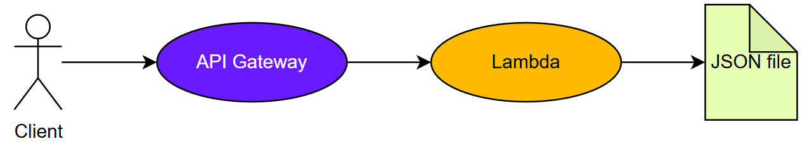

# Countries API


## Table of Contents
- [Introduction](#introduction)
- [Features](#features)
- [Example Data](#example-data-json)
- [Example Requests](#example-requests)
- [Tech Stack](#tech-stack)
- [Deployment](#deployment)
- [Architecture](#architecture)
- [Evolution](#evolution)
- [Conclusion](#conclusion)

## Introduction
This is a simple serverless API built with AWS Lambda and API Gateway that provides information about countries.
I decided to include only UN-recognized countries to remain as politically neutral as possible.
This project demonstrates the use of AWS cloud services, JSON data management, and RESTful API design.
While this project is intentionally kept simple, it has been designed to be easily extended with more features (e.g., live data sources, authentication, or caching).
I built this API as part of my internship search to demonstrate my cloud skills and interest in the field.

## Features
- `GET /` -> Health check (returns "API is running")
- `GET /countries` -> Returns a list of countries (default: all, use ?limit=n for pagination)
- `GET /countries/{alpha2}` -> Returns details of a country by its 2-letter ISO code
- `GET /search?name=xyz` -> Search for countries by name (English or French)

## Example Data (JSON)
```
{
  "alpha2" : "AT",
  "alpha3" : "AUT",
  "bordering_countries" : ["Czech Republic", "Germany", "Hungary", "Italy", "Liechtenstein", "Slovakia", "Slovenia", "Switzerland"],
  "capital" : "Vienna",
  "continent" : "Europe",
  "currency" : "Euro",
  "demonym" : "Austrian",
  "flag" : "🇦🇹",
  "language" : "German",
  "long_name" : "Republic of Austria",
  "name" : "Austria",
  "name_de" : "Österreich",
  "name_fr" : "Autriche"
}
```

## Example Requests
### Health check
curl https://bb2sbxnvbh.execute-api.eu-north-1.amazonaws.com/

### Get all countries (limit 5)
curl https://bb2sbxnvbh.execute-api.eu-north-1.amazonaws.com/countries?limit=5

### Get France
curl https://bb2sbxnvbh.execute-api.eu-north-1.amazonaws.com/countries/FR

### Search by name
curl https://bb2sbxnvbh.execute-api.eu-north-1.amazonaws.com/search?name=be

## Tech Stack
- AWS Lambda
- Amazon API Gateway - API exposure
- Python 3.13 - backend logic
- JSON - static dataset

## Deployment
1. Upload the `app.py` and the `data/countries.json` files to Amazon Lambda.
2. Set the handler to `app.handler`.
3. Create an HTTP API gateway.
4. Associate the gateway to the Lambda function.
5. Configure a route: `GET /{proxy+}` (or ANY method).
6. Deploy the API, and retrieve the public endpoint.
The program already executes the right piece of code according to the path.

There are many other ways to deploy, but this one is probably the simplest.
Note: Lambda functions have a [size limit](https://docs.aws.amazon.com/lambda/latest/dg/gettingstarted-limits.html). For larger datasets, consider using S3 or DynamoDB.

## Architecture


## Evolution
- Add more countries to the JSON file.
- Automate deployment with Bash scripts or CI/CD pipelines.
- Build a simple frontend to visualize the API.
- Replace the static JSON file with a live data source (e.g. REST API or database).

## Conclusion
This project was built to demonstrate my motivation and technical interest in cloud computing.
Through this project, I learned how to deploy a serverless application, handle routing with API Gateway, and manage structured data efficiently in AWS Lambda.
